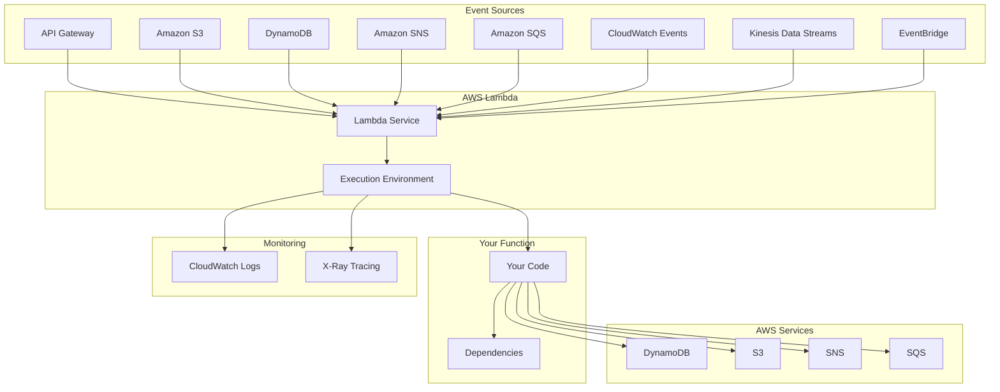
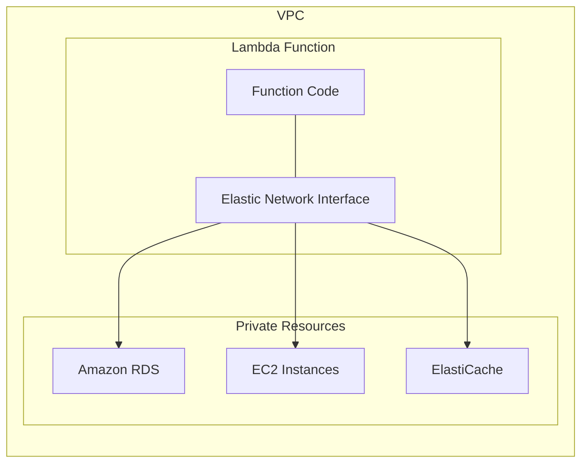
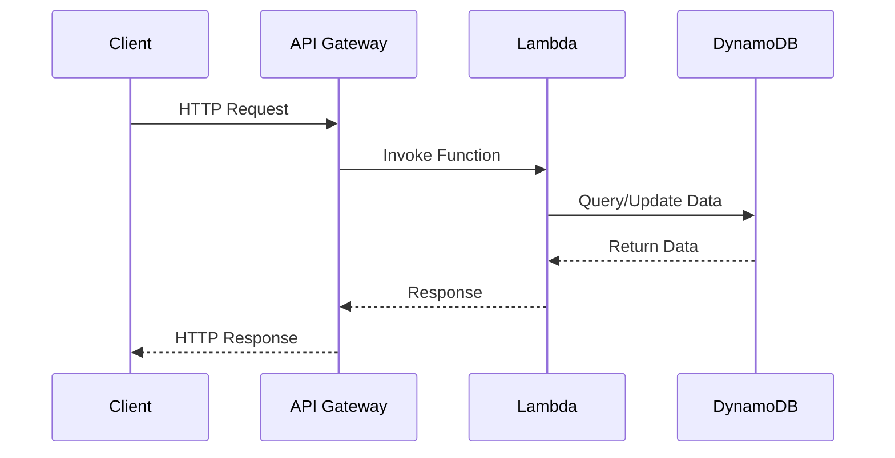
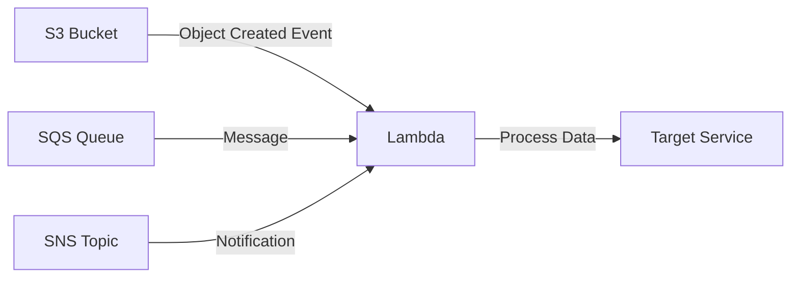
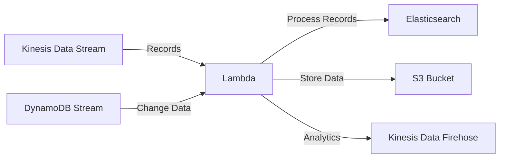
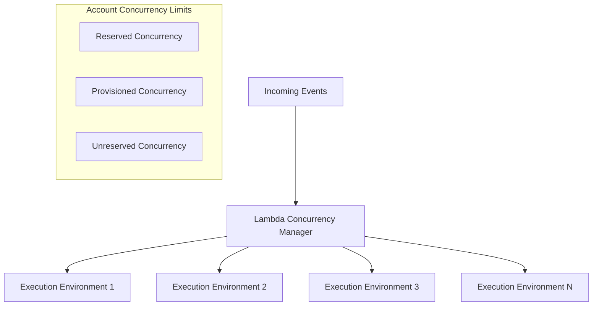
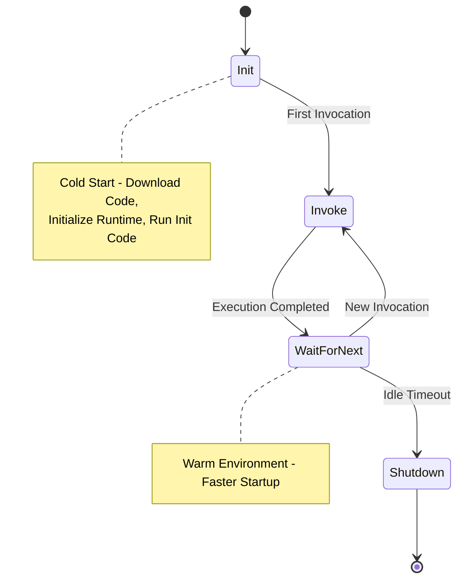

# AWS Lambda Architecture Diagrams

## Core Lambda Architecture

## VPC Integration Architecture

## API Backend Pattern

## Event Processing Pattern

## Stream Processing Pattern

## Lambda Scaling and Concurrency

## Lambda Execution Environment Lifecycle

